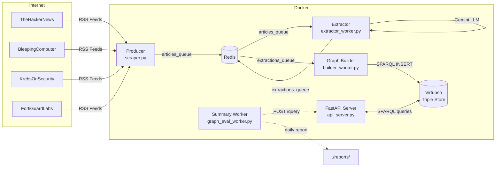
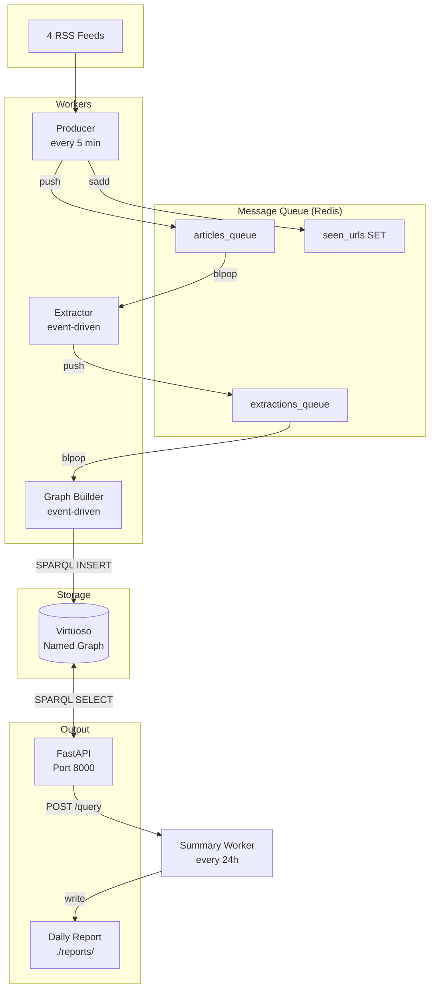

# Cybersecurity Knowledge Graph (CSKG) from Unstructured Data

> **Automated threat intelligence extraction, ontology mapping, and knowledge graph construction from security news feeds.**

[](#quick-start)
[](https://www.python.org/)
[](http://docs.oasis-open.org/cti/ns/stix#)
[](https://virtuoso.openlinksw.com/)

**Live Endpoints (when running):**
- **REST API Docs** → `http://localhost:8000/docs`
- **SPARQL Console** → `http://localhost:8890/sparql`

---

## 1. What is CSKG?

Imagine reading dozens of cybersecurity blogs every day and trying to remember which threat actor uses which malware and who they target. CSKG does this automatically.

It is a **living knowledge graph** built from security news (RSS feeds, reports, and articles). An LLM reads each article, extracts entities like threat actors and vulnerabilities, maps them to a formal cybersecurity ontology (STIX), and stores them as linked data in a graph database. The result is a queryable, always-updating map of the global threat landscape.

**In plain terms:** It turns news articles into a structured database you can ask questions like *"Which threat actors are targeting healthcare right now?"* or *"What malware is linked to CVE-2025-XXXX?"*

---

## 2. System at a Glance



**Services (6 Docker containers):**

| Service | Purpose | Key Tech |
|---|---|---|
| `producer` | Scrape RSS feeds every 5 min, deduplicate, queue articles | `feedparser`, `BeautifulSoup`, `redis` |
| `extractor` | Pop articles from queue, run LLM to extract entities/relations | `LangChain`, `Gemini 2.0 Flash Lite`, `Pydantic` |
| `graph_builder` | Pop extractions, build RDF triples, insert into Virtuoso | `rdflib`, `SPARQLWrapper` |
| `api` | REST API for querying the graph | `FastAPI`, `SPARQLWrapper` |
| `summary` | Run every 24h: query graph, generate strategic brief | `LangChain`, `Gemini` |
| `virtuoso` | Persistent RDF triple store | `Virtuoso Open Source` |
| `redis` | Message queue between producer → extractor → builder | `Redis 7` |

---

## 3. One Article's Journey

Let's trace what happens when a new article appears on BleepingComputer titled *"Deep dive into DragonForce ransomware and its Scattered Spider connection"*.

### Step 1: Scrape
`producer` fetches the RSS feed, strips HTML, and pushes a JSON article:
```json
{
  "title": "Deep dive into DragonForce ransomware...",
  "link": "https://www.bleepingcomputer.com/...",
  "published": "Wed, 03 Dec 2025 10:05:15 -0500",
  "content": "DragonForce is a ransomware group that uses Scattered Spider..."
}
```

### Step 2: Extract
`extractor` sends the article text to Gemini. The LLM returns structured data:
```json
{
  "threat_actors": ["DragonForce", "Scattered Spider"],
  "malware": [],
  "attack_patterns": ["initial access", "social engineering"],
  "vulnerabilities": [],
  "indicators": [],
  "relations": [
    {"subject": "DragonForce", "relation": "uses", "object": "Scattered Spider"},
    {"subject": "Scattered Spider", "relation": "uses", "object": "social engineering"},
    {"subject": "Scattered Spider", "relation": "uses", "object": "initial access"}
  ]
}
```

### Step 3: Build Graph
`graph_builder` transforms this into RDF triples and inserts them into Virtuoso:

```turtle
@prefix stix: <http://docs.oasis-open.org/cti/ns/stix#> .
@prefix cskg: <http://group2.org/cskg/> .
@prefix rdfs: <http://www.w3.org/2000/01/rdf-schema#> .

<article-url> a stix:Report ;
    stix:mentions cskg:dragonforce ,
                  cskg:scatteredspider ,
                  cskg:socialengineering ,
                  cskg:initialaccess .

cskg:dragonforce a stix:ThreatActor .
cskg:scatteredspider a stix:ThreatActor ;
    rdfs:label "Scattered Spider" ;
    stix:uses cskg:socialengineering ,
              cskg:initialaccess .
```

### Step 4: Query
You can now query the live graph via REST API or SPARQL:
```sparql
SELECT * WHERE {
  ?actor a stix:ThreatActor ;
         rdfs:label "DragonForce" .
  ?actor stix:uses ?tool .
  ?tool rdfs:label ?tool_name .
}
```

---

## 4. Quick Start

### Prerequisites
- Docker & Docker Compose
- A Google API key with Gemini access

### Run it
```bash
# 1. Clone
git clone <your-repo-url>
cd <repo-name>

# 2. Add your API key
echo "GOOGLE_API_KEY=your_key_here" > .env

# 3. Start all services
docker compose up --build -d

# 4. Check status
curl http://localhost:8000/
# → {"status": "online", "total_triples": 1234}

# 5. View live logs
docker compose logs -f producer extractor graph_builder summary
```

### Access Points
| Service | URL | Purpose |
|---|---|---|
| REST API | `http://localhost:8000/docs` | Swagger UI for POST /query |
| SPARQL UI | `http://localhost:8890/sparql` | Direct Virtuoso console |
| Reports | `./reports/daily_brief_*.md` | Auto-generated daily briefs |

---

## 5. Service Architecture



**All workers share the same Docker image.** `compose.yml` overrides the `command:` for each service. The queue pattern uses Redis `BLPOP` (blocking pop) so workers are event-driven and consume efficiently.

---

## 6. The Knowledge Graph (For Experts)

### Ontology
CSKG uses **STIX 2.1** as its primary ontology, supplemented by a custom namespace `http://group2.org/cskg/`.

**Entity Types Mapped:**
| Extracted Type | STIX Class |
|---|---|
| Threat Actor | `stix:ThreatActor` |
| Malware | `stix:Malware` |
| Vulnerability | `stix:Vulnerability` |
| Indicator | `stix:Indicator` |
| Attack Pattern | `stix:AttackPattern` |
| Report | `stix:Report` |

**Relationship Mapping (16 verbs):**
```python
RELATIONSHIP_MAP = {
    "uses": STIX.uses,
    "targets": STIX.targets,
    "exploits": STIX.exploits,
    "mitigates": STIX.mitigates,
    "attributed_to": STIX.attributed_to,
    "variant_of": STIX.variant_of,
    "located_in": STIX.located_in,
    "impersonates": STIX.impersonates,
    "reports": STIX.reports,
    "patched": STIX.patched,
    "resolved": STIX.resolved,
    "disrupted": STIX.disrupted,
    "aligned_with": STIX.aligned_with,
    "observes": STIX.observes,
    "has_similarities_with": STIX.has_similarities_with,
    "propagated_via": STIX.propagated_via,
}
```

### Dual-URI Entity Resolution
To handle variations in entity names (e.g., `DragonForce` vs `dragonforce`) while preserving original labels, the pipeline creates **two nodes per entity**:

- **Canonical URI** (`safe_uri`): normalized, lowercase, alphanumeric only. Used for all relationships.
- **Labeled URI** (`unsafe_uri`): preserves original text as `rdfs:label`. Linked to canonical via `owl:sameAs`.

Example:
```turtle
cskg:dragonforce a stix:ThreatActor .
cskg:DragonForce a stix:ThreatActor ;
    rdfs:label "DragonForce" ;
    owl:sameAs cskg:dragonforce .
```

### External KG Linking: SEPSES CVE
When a vulnerability is detected as a CVE ID, the pipeline links to the **SEPSES CVE Knowledge Graph** instead of creating a local node:

```python
cve_match = re.search(r"(CVE-\d{4}-\d{4,})", vuln, re.IGNORECASE)
if cve_match:
    cve_id = cve_match.group(1).upper()
    vuln_uri = SEPSES_CVE[cve_id]  # https://w3id.org/sepses/resource/cve/CVE-XXXX-XXXX
```

This enables queries that span both CSKG and the rich external CVE data from SEPSES.

---

## 7. Querying the Graph

### Via REST API
```bash
curl -X POST http://localhost:8000/query \
  -H "Content-Type: application/json" \
  -d '{"query": "SELECT ?s ?p ?o WHERE { ?s ?p ?o } LIMIT 10"}'
```

### Via SPARQL Console
Open `http://localhost:8890/sparql` and run queries directly against the named graph `<http://group2.org/cskg>`.

### Example Use Cases

#### Use Case 1: Threat Actor Profiling
**Question:** "What malware and attack patterns does the threat actor 'Konni' use, based on recent reports?"

```sparql
PREFIX cskg: <http://group2.org/cskg/>
PREFIX stix: <http://docs.oasis-open.org/cti/ns/stix#>
PREFIX rdfs: <http://www.w3.org/2000/01/rdf-schema#>

SELECT DISTINCT ?malware_label ?pattern_label
WHERE {
  GRAPH <http://group2.org/cskg> {
    # Find the Konni threat actor
    ?actor a stix:ThreatActor ;
           rdfs:label "Konni" .
    
    # Find malware it uses
    OPTIONAL {
      ?actor stix:uses ?malware .
      ?malware a stix:Malware ;
               rdfs:label ?malware_label .
    }
    
    # Find attack patterns it uses
    OPTIONAL {
      ?actor stix:uses ?pattern .
      ?pattern a stix:AttackPattern ;
               rdfs:label ?pattern_label .
    }
  }
}
```

#### Use Case 2: Vulnerability Impact Assessment
**Question:** "We are vulnerable to 'CVE-2025-12480'. Which threat actors are actively exploiting it?"

```sparql
PREFIX cskg: <http://group2.org/cskg/>
PREFIX stix: <http://docs.oasis-open.org/cti/ns/stix#>
PREFIX rdfs: <http://www.w3.org/2000/01/rdf-schema#>
PREFIX sepses: <https://w3id.org/sepses/resource/cve/>

SELECT DISTINCT ?actor_label
WHERE {
  GRAPH <http://group2.org/cskg> {
    # Find the CVE (using its linked SEPSES URI)
    BIND(sepses:CVE-2025-12480 AS ?cve)
    
    ?cve a stix:Vulnerability .
    
    # Find any threat actor that exploits it
    ?actor stix:exploits ?cve ;
           a stix:ThreatActor ;
           rdfs:label ?actor_label .
  }
}
```

#### Use Case 3: Incident Response & Triage
**Question:** "We found the indicator 'GlassWorm' in our logs. What is it, and what reports mention it?"

```sparql
PREFIX cskg: <http://group2.org/cskg/>
PREFIX stix: <http://docs.oasis-open.org/cti/ns/stix#>
PREFIX rdfs: <http://www.w3.org/2000/01/rdf-schema#>

SELECT ?entity_label ?entity_type ?report_url
WHERE {
  GRAPH <http://group2.org/cskg> {
    # Find the entity by its label
    ?entity rdfs:label "GlassWorm" ;
            a ?entity_type ;
            rdfs:label ?entity_label .
    
    # Find the report that mentions it
    ?report stix:mentions ?entity ;
            a stix:Report .
    
    # Get the URL of the report
    BIND(IRI(str(?report)) as ?report_url)
    
    # Filter for only STIX types
    FILTER(CONTAINS(str(?entity_type), "stix"))
  }
}
```

---

## 8. Daily Intelligence Reports

The **summary worker** (`graph_eval_worker.py`) runs every 24 hours. It queries the graph for all active threat actors, their malware, and targets, then generates a **Strategic Threat Landscape Assessment** using Gemini.

**Output:** Markdown reports saved to `./reports/daily_brief_YYYY-MM-DD.md`.

Typical report structure:
1. **Executive Summary** — Key trends observed
2. **Key Threat Actors** — Active groups and their capabilities
3. **Tooling Trends** — Most frequently observed malware / techniques
4. **Strategic Assessment** — Implications for defense
5. **Recommendations** — Actionable mitigations

**To see the latest report:**
```bash
ls -lt reports/daily_brief_*.md | head -1
```

---

## 9. Architecture Notes

### Why Redis Queues?
Instead of direct HTTP calls between services, we use Redis `LIST`s with `BLPOP` for loose coupling. This means:
- Workers can crash and restart without losing jobs.
- The `producer` and `extractor` run at different speeds without blocking each other.
- New worker instances can be scaled horizontally by running more extractors/builders.

### Why STIX?
STIX (Structured Threat Information Expression) is the industry-standard threat intelligence ontology. By mapping our LLM extractions directly to STIX classes, our graph is immediately compatible with existing TI tools (MISP, OpenCTI, TAXII servers).

### Shared Docker Image
All Python services share one Dockerfile. `compose.yml` selects which module to run via `command:`. This keeps image size small and makes local development simple — just change a file and restart the service.

### Database Initialization
On first startup, Virtuoso runs `pipeline/virtuoso-scripts/init.sql` automatically to grant `SPARQL_FED`, `SPARQL_UPDATE`, and read/write permissions on the named graph `http://group2.org/cskg`.

---

## 10. Export & Backup

### Dump the Full Graph
Run from your host machine (not inside Docker):
```bash
python server/cskg_dump.py
```
This saves `cskg_full_dump.ttl` — a complete Turtle dump of the live graph.

### Load a Dump into Virtuoso
You can load a `.ttl` file via the Virtuoso SQL console at `http://localhost:8890/conductor` or via `isql`:
```sql
DB.DBA.TTLP(file_to_string_output('/path/to/cskg_full_dump.ttl'), '', 'http://group2.org/cskg', 0);
```

---

## License

Apache-2.0 License
